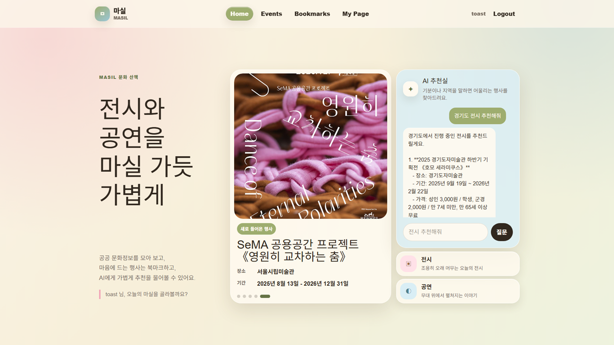
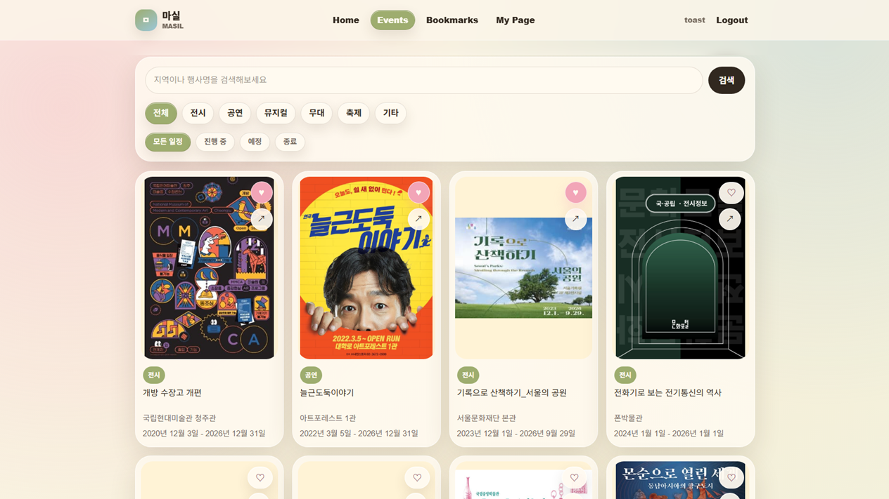
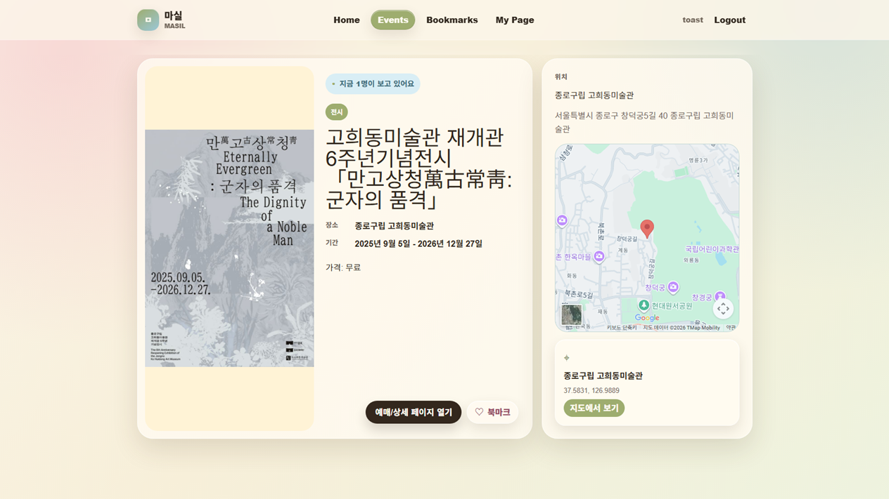
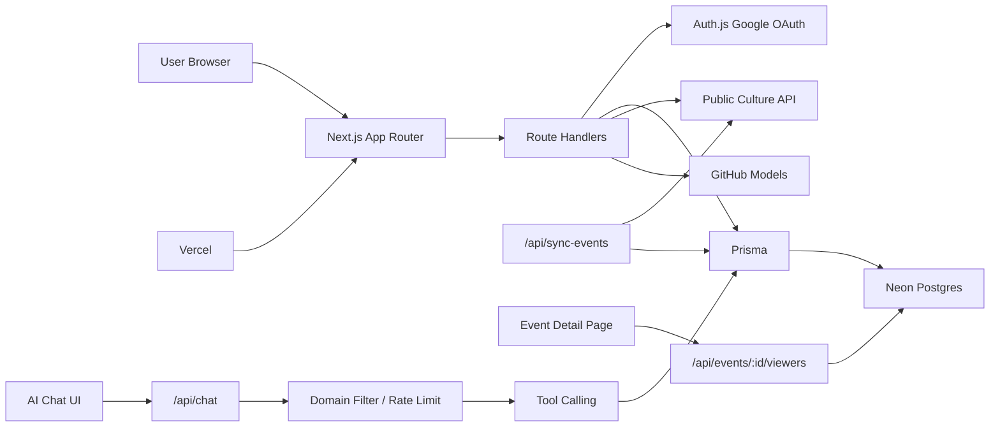
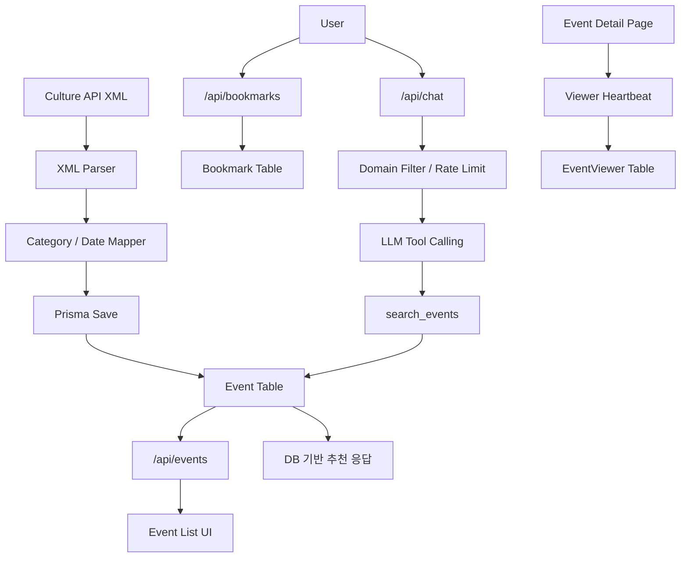
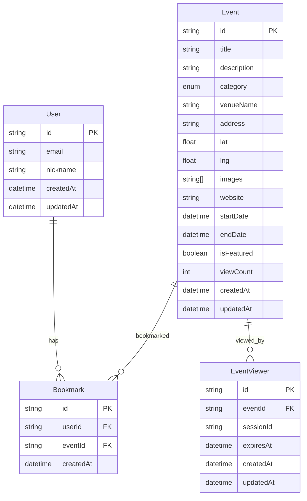
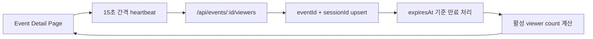
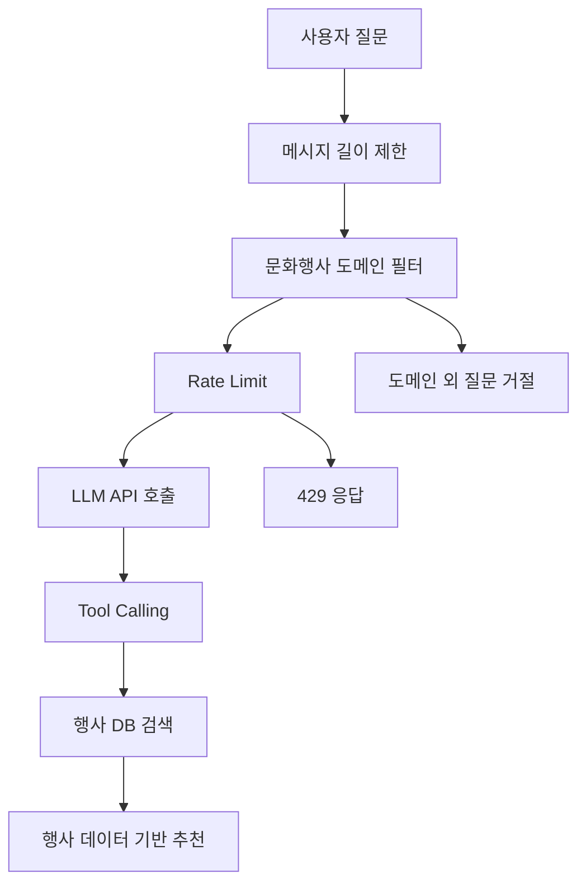

<p align="center">
  
</p>

# 마실 Masil

공공 문화행사 정보를 수집하고, 사용자가 전시와 공연 정보를 탐색, 북마크, AI 추천받을 수 있는 문화생활 탐색 서비스입니다.

마실은 "이웃에 놀러 다니는 일"이라는 뜻을 가진 이름입니다. 사용자가 부담 없이 문화행사를 둘러보고, 마음에 드는 나들이를 고를 수 있도록 설계했습니다.

- Service: https://masil-plum.vercel.app
- Repository: GitHub URL

## Preview



## 주요 화면

| 이벤트 목록 | 행사 상세 |
| --- | --- |
|  |  |

## 주요 기능

- 공공 Culture API 기반 문화행사 데이터 수집
- 행사 목록 검색 및 필터링
  - 행사명, 지역, 장소 기반 키워드 검색
  - 카테고리 필터
  - 진행 상태 필터
- 행사 상세 페이지
  - 행사 이미지, 제목, 장소, 기간, 가격, 상세 링크 제공
  - 현재 상세 페이지를 보고 있는 사용자 수 표시
- Google OAuth 기반 소셜 로그인
- 로그인 사용자 북마크 저장 및 조회
- 마이페이지 닉네임 수정
- AI 문화행사 추천 채팅
  - 문화행사 도메인 질문만 허용
  - 실제 DB 행사 검색 결과 기반 추천
  - 사용자/IP 기준 rate limit 적용
- Vercel 배포 환경 데이터 동기화
  - 보호된 sync API
  - CRON_SECRET 기반 인증

## 기술 스택

### Frontend

- Next.js App Router
- React
- TypeScript
- Tailwind CSS

### Backend

- Next.js Route Handlers
- Auth.js / NextAuth
- Prisma
- Neon Postgres

### External Integration

- Public Culture API
- GitHub Models
- Google OAuth

### Deployment

- Vercel
- Neon Postgres
- Prisma Migration

## 전체 아키텍처



## 데이터 흐름



## ERD



## 주요 문제 해결

### 1. Vercel 서버리스 환경에서 상세 페이지 접속자 수 집계 안정화

초기에는 Socket.IO 기반으로 상세 페이지 접속자 수를 집계했습니다.  
하지만 Vercel 서버리스 환경에서는 인메모리 상태와 장기 연결을 안정적으로 유지하기 어렵기 때문에, 배포 환경에 맞는 구조가 필요했습니다.

이를 해결하기 위해 Neon Postgres 기반 heartbeat 구조로 전환했습니다.

- 클라이언트가 15초마다 `sessionId`를 포함한 heartbeat 요청
- 서버는 `eventId + sessionId` 기준으로 viewer row upsert
- `expiresAt`이 지난 row는 비활성 viewer로 제외
- 유효한 viewer count만 상세 페이지에 표시

결과적으로 별도 실시간 서버 없이 Vercel 배포 환경에서 상세 페이지별 현재 접속자 수를 안정적으로 표시할 수 있게 되었습니다.



### 2. AI 채팅 오남용 및 비용 증가 방지

AI 채팅 기능은 사용자가 문화행사와 무관한 질문을 입력하거나 반복 호출할 경우, 서비스 목적에서 벗어나고 비용이 증가할 위험이 있었습니다.

이를 줄이기 위해 AI 호출 전에 기본 방어 로직을 적용했습니다.

- 문화행사 도메인 키워드 필터
- 메시지 길이 제한
- 사용자/IP/global 기준 rate limit
- system prompt 기반 역할 제한
- function calling 기반 행사 검색
- 실제 DB 행사 데이터 기반 추천 응답

결과적으로 AI 기능을 단순 질의응답이 아니라 문화행사 추천이라는 서비스 목적 안에서 동작하도록 제한했습니다.



### 3. Culture API 전환 및 데이터 수집 구조 재설계

기존 KOPIS API 기반 수집 구조에서 공공 Culture API 기반 구조로 전환했습니다.  
API 응답 구조가 달라져 XML 파싱, 카테고리 매핑, 날짜 변환, DB 저장 흐름을 다시 설계해야 했습니다.

- Culture API XML 응답 파싱
- 행사 카테고리 enum 매핑
- 날짜 문자열을 Date 타입으로 변환
- Prisma 기반 행사 데이터 저장
- 목록, 상세, AI 추천에서 동일한 Event 모델 사용

결과적으로 외부 API 변경에도 서비스 내부 데이터 모델을 유지하면서 문화행사 데이터를 안정적으로 수집할 수 있게 되었습니다.

### 4. 북마크 상태 동기화 문제 해결

북마크 저장은 DB에 정상 반영되었지만, 목록 API가 현재 사용자의 북마크 여부를 내려주지 않아 새로고침 후 UI 상태가 초기화되는 문제가 있었습니다.

이를 해결하기 위해 행사 목록 조회 시 현재 session을 확인하고, 조회된 event id 기준으로 사용자의 북마크 목록을 함께 조회하도록 변경했습니다.

- 목록 조회 시 현재 로그인 사용자 확인
- event id 기준 사용자 bookmark 조회
- 각 event item에 `isBookmarked` 포함
- EventCard와 BookmarkButton 상태 동기화

결과적으로 새로고침 후에도 북마크된 카드가 올바르게 표시되도록 개선했습니다.

### 5. 배포 환경 데이터 동기화 구성

로컬 DB에 의존하면 배포 환경에서 최신 문화행사 데이터를 유지하기 어렵습니다.  
이를 해결하기 위해 Neon Postgres와 Prisma migration 기반 운영 DB를 구성하고, 보호된 sync API를 통해 데이터를 갱신하도록 설계했습니다.

- Neon Postgres 운영 DB 구성
- Prisma migration 적용
- `/api/sync-events` API 구성
- `CRON_SECRET` 기반 인증
- Vercel 환경에서 행사 데이터 갱신 가능

결과적으로 로컬 PC 없이도 배포 환경에서 서비스 데이터를 유지할 수 있는 구조를 만들었습니다.

### 6. Next.js App Router 배포 빌드 오류 해결

Vercel production build 과정에서 `useSearchParams` 사용으로 인해 prerendering 오류가 발생했습니다.

이를 해결하기 위해 검색 파라미터를 사용하는 목록 화면을 클라이언트 컴포넌트로 분리하고 Suspense boundary를 적용했습니다.

- `/events` 페이지의 server/client 역할 분리
- `useSearchParams` 사용 컴포넌트를 Suspense 내부에서 렌더링
- Vercel production build 통과 확인

결과적으로 로컬 개발 환경에서는 드러나지 않았던 배포 빌드 문제를 해결하고 안정적으로 배포할 수 있었습니다.

## API 명세

| Method | Endpoint | Auth | Description |
| --- | --- | --- | --- |
| GET | `/api/events` | Optional | 행사 목록 조회, 검색/카테고리/상태 필터, 북마크 여부 포함 |
| GET | `/api/events/:id` | Optional | 행사 상세 조회 |
| GET | `/api/events/trending` | No | 홈 화면 트렌딩 행사 조회 |
| POST | `/api/bookmarks` | Required | 행사 북마크 추가/해제 |
| GET | `/api/me/bookmarks` | Required | 내 북마크 행사 목록 조회 |
| GET | `/api/me` | Required | 내 프로필 조회 |
| PATCH | `/api/me` | Required | 닉네임 수정 |
| POST | `/api/chat` | Rate Limited | AI 문화행사 추천 채팅 |
| POST | `/api/events/:id/viewers` | No | 상세 페이지 viewer heartbeat 갱신 |
| POST | `/api/sync-events` | Cron Secret | Culture API 행사 데이터 동기화 |

## 로컬 실행 방법

### 1. 의존성 설치

```bash
npm install
```

### 2. 환경변수 설정

`.env.example`을 참고해 `.env` 파일을 생성합니다.

```env
DATABASE_URL=

AUTH_SECRET=
AUTH_URL=
NEXTAUTH_URL=

GOOGLE_CLIENT_ID=
GOOGLE_CLIENT_SECRET=

CULTURE_API_KEY=

LLM_BASE_URL=
LLM_API_KEY=
LLM_MODEL=

CRON_SECRET=
NEXT_PUBLIC_APP_URL=
```

### 3. Prisma 설정

```bash
npx prisma generate
npx prisma migrate dev
```

### 4. 개발 서버 실행

```bash
npm run dev
```

## 배포

이 프로젝트는 Vercel과 Neon Postgres 기반으로 배포했습니다.

배포 시 필요한 작업은 다음과 같습니다.

- Vercel 환경변수 등록
- Neon Postgres 연결
- Prisma migration 적용
- Google OAuth redirect URI 등록
- `CRON_SECRET` 설정
- Culture API service key 설정
- GitHub Models 환경변수 설정

## 배운 점

- 로컬에서 동작하던 Socket.IO 구조가 서버리스 배포 환경에서는 그대로 적합하지 않을 수 있음을 경험했습니다.
- 배포 환경 제약에 맞춰 Neon heartbeat 기반 구조로 전환하며 운영 가능한 구조를 우선하는 판단을 했습니다.
- AI 기능은 단순 연동보다 도메인 제한, 비용 제한, 데이터 기반 응답 보장이 중요하다는 점을 반영했습니다.
- 공공 API 응답 구조 변경에 맞춰 수집, 매핑, 저장 흐름을 재설계하며 데이터 파이프라인의 중요성을 경험했습니다.
- Vercel, Neon Postgres, Prisma migration을 활용해 로컬 PC에 의존하지 않는 서버리스 배포 구조를 구성했습니다.

